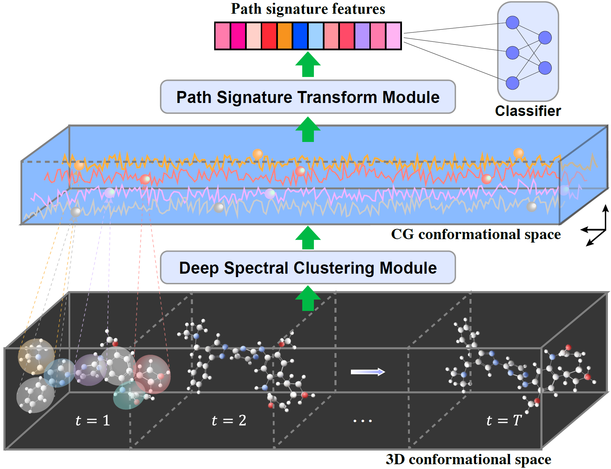

<h2 align="center">
<p> Deep Signature: Characterization of Large-Scale Molecular Dynamics</p>
</h2>

---

<p align="center">
    
    <!-- <br>Fig 1. The overview of network architecture for Deep Signature.</br> -->
</p>


This repository provides the official implementations and experiments for our paper "[Deep Signature: Characterization of Large-Scale Molecular Dynamics](https://openreview.net/pdf?id=xayT1nn8Mg)". The core code for implement our method can be found in [models/deep_signature.py](models/deep_signature.py). Please follow the steps to prepare running environment, and run our code.

### Prepare Environment

    conda create -n torch python=3.9

    conda activate torch

    conda install scipy Pillow Pyyaml tqdm pandas scikit-image scikit-learn matplotlib seaborn networkx numba h5py

    conda install -c conda-forge mdtraj mdanalysisdata mdanalysis

    pip install torch==1.9.0+cu111 torchvision==0.10.0+cu111 torchaudio==0.9.0 -f https://download.pytorch.org/whl/torch_stable.html

    pip install torch_scatter==2.0.9 torch_sparse==0.6.12 torch_cluster==1.5.9 torch_spline_conv==1.2.1 -f https://pytorch-geometric.com/whl/torch-1.9.0+cu111.html

    pip install signatory==1.2.6.1.9.0 --no-cache-dir --force-reinstall
    pip install moviepy
    pip install torchdiffeq
    pip install rdkit
    pip install wandb


### 🚀 Quick Start


#### 1. Download Datasets

You can download our processed data for [GPCR](https://drive.google.com/file/d/1Q6H8C7GEm1m3kyzgWNdCgtBlKPSI-dwH/view?usp=drive_link) by the link, after download and unzip the file, just specify the file path in the script.


#### 2. Running
```
# 1. Model training for the GPCR dataset
chmod +x ./scripts/*
./scripts/gpcr_graph_sig.sh
```
You can find the running commands for other baselines in the [scripts](scripts) file.


### Citations
If you find this repo useful for your research, please cite the following papers:

    @inproceedings{Qin2025ICLR,
        title={Deep Signature: Characterization of Large-Scale Molecular Dynamics},
        author={Tiexin Qin, Mengxu Zhu, Chunyang Li, Terry Lyons, Hong Yan and Haoliang Li},
        booktitle={The Thirteenth International Conference on Learning Representations},
        year={2025},
        url={https://openreview.net/forum?id=xayT1nn8Mg}
    }